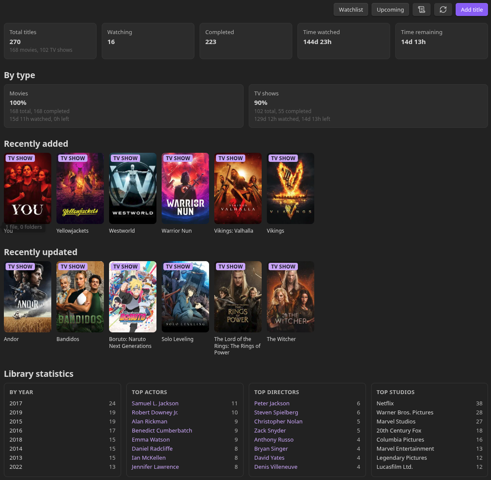
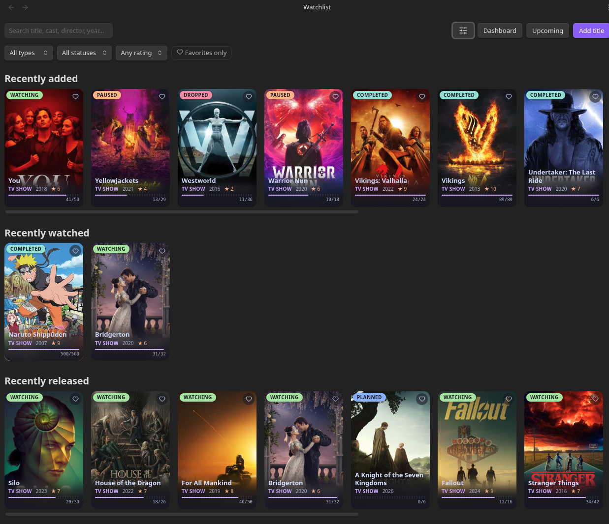
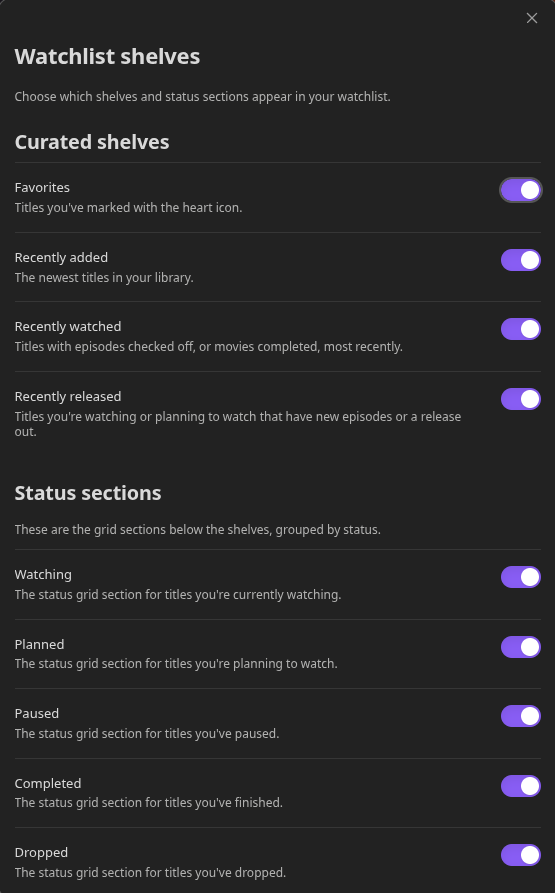
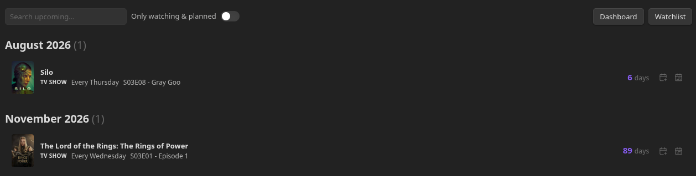
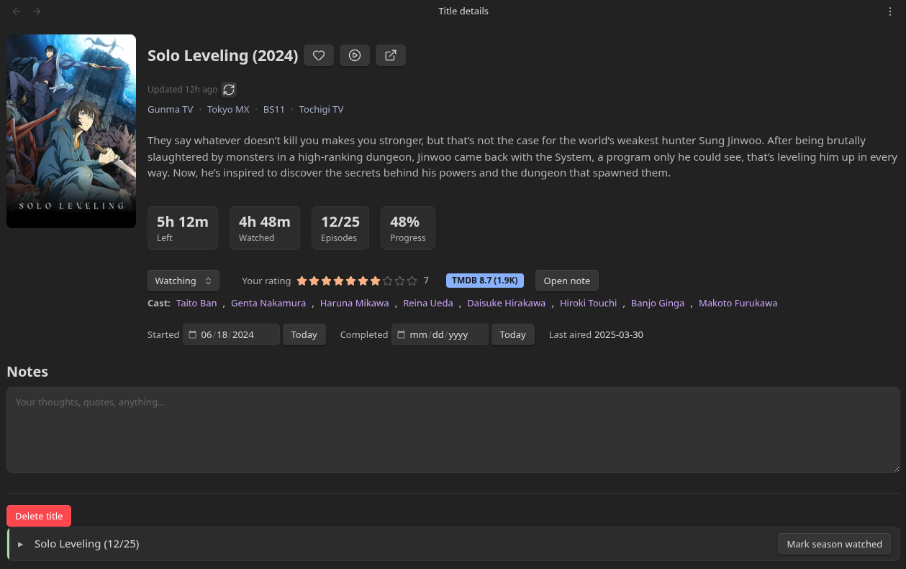
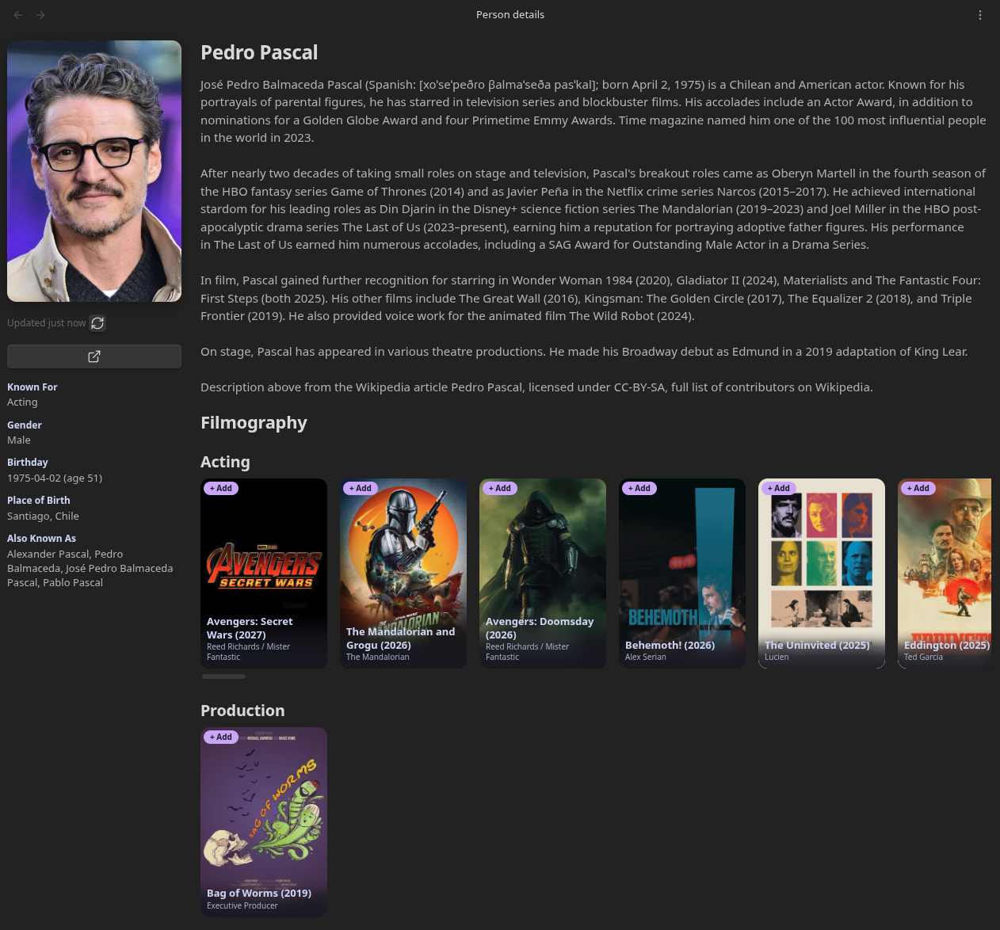

# Marathoner

An [Obsidian](https://obsidian.md) plugin for tracking the movies and TV
shows you watch, right inside your vault - powered by [TMDB](https://www.themoviedb.org/).
Every title and person is a real Markdown note, fully readable and
searchable like the rest of your vault, and everything works offline once
it's been added.

Marathoner Screenshots

### Dashboard

### Watchlist

### Upcoming

### Title Note

### Person Note

## Features

- **Watchlist** with curated shelves (Favorites, Recently added/watched/released),
  a status grid (Watching / Planned / Paused / Completed / Dropped), search,
  and filters (type, status, rating, favorites) - all individually toggleable.
- **Per-episode tracking** for TV shows, with automatic status completion
  when every aired episode is watched.
- **Per-episode ratings** on the same 1-10 scale as the overall show or movie
  rating.
- **Custom covers** for any movie or TV show, stored directly in the vault
  with a one-click return to the original TMDB artwork.
- **Mobile-friendly interface** with responsive layouts, touch-sized controls,
  and native rating and calendar sharing flows on phones and tablets.
- **Offline-first**: synopsis, cast, crew, season/episode data, filmography,
  and posters are all cached locally at add time. Opening a note never hits
  the network - only a scheduled refresh (daily/weekly/manual, your choice)
  or an explicit "Refresh" button does.
- **Person notes** - optionally auto-created for cast/directors, with
  biography, personal info, and full filmography.
- **Dashboard** with library statistics: total watch time, top actors,
  directors, and studios (linked to their notes), and a by-year breakdown.
- **Upcoming** view - a simple, compact list of what's airing or releasing
  next, with a one-click "Add to Google Calendar" link per title, and a
  bulk `.ics` export for the rest of a season.
- **Activity log** of everything you do - titles added/removed, episodes
  and statuses changed, refreshes.
- **Import from another app** - Trakt (full export), Letterboxd, Simkl,
  IMDb, and Ryot, matched to TMDB automatically.
- Catppuccin Mocha visual style throughout.

## Installation

### Via BRAT (recommended while this isn't in the official community list)

1. Install the [BRAT](https://github.com/TfTHacker/obsidian42-brat) plugin
   from Community Plugins.
2. In BRAT's settings, choose **Add Beta Plugin**, and enter this repo's
   URL.
3. Enable Marathoner under Community Plugins.

### Manual installation

1. Download `main.js`, `manifest.json`, and `styles.css` from the
   [latest release](../../releases/latest).
2. Create a folder named `marathoner` inside your vault's
   `.obsidian/plugins/` directory, and put those three files in it.
3. Reload Obsidian (or disable/re-enable Community Plugins) and enable
   Marathoner.

## Configuration

Go to **Settings > Marathoner** and paste your TMDB **Read Access Token
(v4)** (create one for free at [themoviedb.org](https://www.themoviedb.org/settings/api),
under Settings > API).

From there you can also set the library/people folder locations, the
automatic refresh frequency, whether to create person notes for cast/directors,
and whether to store poster/photo images locally in the vault. Enabling local
images automatically fills in missing posters and photos in the background.

## Custom covers

Open a movie or TV show in Marathoner and use the image button next to its
title to choose a cover from your device. JPEG, PNG, WebP, GIF, and AVIF files
up to 20 MB are supported. The selected image is copied into the configured
images folder in your vault and is then used across the watchlist, dashboard,
upcoming releases, title details, and person filmographies.

Custom covers work independently of the **Store images locally** setting. Use
the restore button next to the title at any time to return to the original TMDB
artwork; Marathoner removes the replaced managed custom file automatically.

## Mobile use

Marathoner uses the same plugin installation on desktop, Android, and iOS—no
separate mobile version is required. On phones, the interface automatically
switches to compact responsive layouts with consistent watchlist grids,
touch-sized actions, stacked detail pages, and native selectors for overall
and per-episode ratings.

Choosing a custom cover opens the device's native photo/file picker. Calendar
exports use the native sharing sheet when the mobile platform supports it and
fall back to a regular `.ics` download otherwise.

## Data model

Each title and person is stored as a regular Markdown note with structured
frontmatter (status, overall and episode ratings, dates, cast, watched episodes, cached TMDB
metadata, etc.) plus a free-form `## Notes` section you can write in
yourself. Nothing is hidden in a database - open any note directly to see
exactly what's stored.

## Attribution

This product uses the TMDB API but is not endorsed or certified by TMDB.

## Contributing

Issues and pull requests are welcome. This is a personal project maintained
in spare time, so response times may vary.

## License

MIT - see [LICENSE](LICENSE).

## ☕ Support My Work

If Marathoner made you love obsidian more or put a smile on your face, consider supporting its development:

